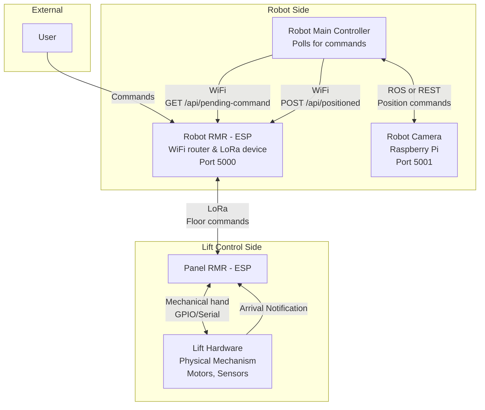

## Component Interaction Overview - Block Diagram

```mermaid
graph TB
    subgraph "External"
        User[User]
    end
    
    subgraph "Robot Side"
        RobotRMR[Robot RMR - ESP<br/>WiFi router & LoRa device<br/>Port 5000]
        RobotMainController[Robot Main Controller<br/>Polls for commands]
        RobotCamera[Robot Camera<br/>Raspberry Pi<br/>Port 5001]
    end
    
    subgraph "Lift Control Side"
        PanelRMR[Panel RMR - ESP]
        LiftHardware[Lift Hardware<br/>Physical Mechanism<br/>Motors, Sensors]
    end
    
    User -->|Commands| RobotRMR
    RobotMainController -->|WiFi<br/>GET /api/pending-command| RobotRMR
    RobotMainController -->|WiFi<br/>POST /api/positioned| RobotRMR
    RobotMainController <-->|ROS or REST<br/>Position commands| RobotCamera
    RobotRMR <-->|LoRa<br/>Floor commands| PanelRMR
    PanelRMR <-->|Mechanical hand<br/>GPIO/Serial| LiftHardware
    LiftHardware -->|Arrival Notification| PanelRMR
```
