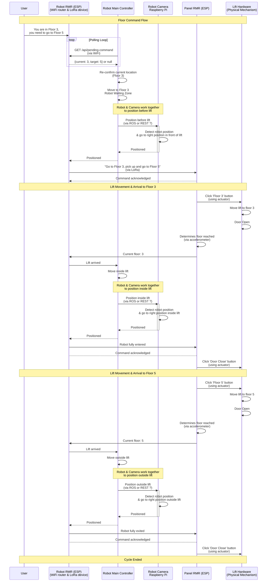

# Lift Control System - Sequence Diagram

## Main Flow: Sending Floor Command



## Component Interaction Overview

```mermaid
graph TB
    subgraph "External"
        User[User]
    end
    
    subgraph "Client Side"
        ClientPi[Robot RMR / ESP - Runs client_example.py]
    end
    
    subgraph "Network Subgraph"
        Network[WiFi/Ethernet<br/>TCP/IP]
    end
    
    subgraph "Lift Control Side"
        LiftPi[Lift Control Pi<br/>Raspberry Pi #2<br/>In Lift Panel]
        LiftService[Panel RMR (ESP)<br/>app.py<br/>Port 5000]
        LiftState[(Lift State<br/>In-Memory)]
    end
    
    subgraph "Hardware"
        LiftHardware[Lift Hardware<br/>Motors, Sensors<br/>Physical Mechanism]
    end
    
    User -->|Commands| ClientPi
    ClientPi <-->|HTTP REST API| Network
    Network <-->|HTTP REST API| LiftPi
    LiftPi --> LiftService
    LiftService <--> LiftState
    LiftService <-->|GPIO/Serial| LiftHardware
    LiftHardware -->|Arrival Notification| LiftService
```

