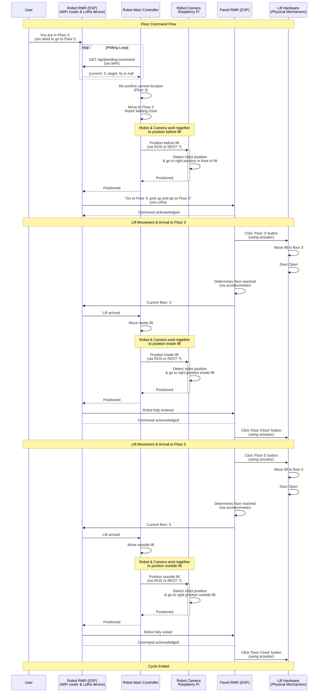
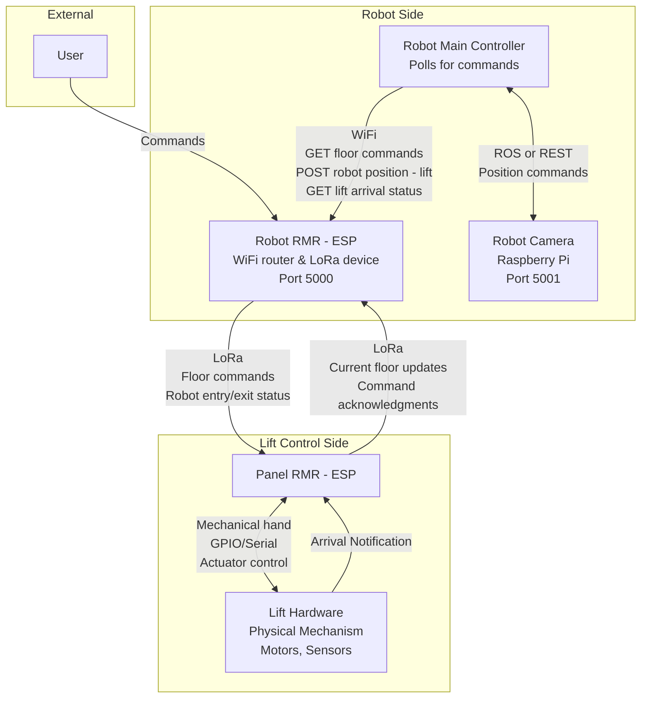

# Lift Control System - Block & Sequence Diagram

## Main Flow Sequence Diagram

```mermaid
sequenceDiagram
    participant User
    participant ClientPi as Robot RMR (ESP)<br/>(WiFi router & LoRa device)
    participant RobotMainController as Robot Main Controller
    participant CameraModule as Robot Camera<br/>Raspberry Pi
    participant LiftService as Panel RMR (ESP)
    participant LiftHardware as Lift Hardware<br/>(Physical Mechanism)

    Note over User,LiftHardware: Floor Command Flow
    User->>ClientPi: You are in Floor 3,<br/>you need to go to Floor 5
    loop Polling Loop
        RobotMainController->>ClientPi: GET /api/pending-command<br/>(via WiFi)
        ClientPi-->>RobotMainController: {current: 3, target: 5} or null
    end
    RobotMainController->>RobotMainController: Re-confirm current location<br/>(Floor 3)
    RobotMainController->>RobotMainController: Move to Floor 3<br/>Robot Waiting Zone
    Note over RobotMainController,CameraModule: Robot & Camera work together<br/>to position before lift
    RobotMainController->>CameraModule: Position before lift<br/>(via ROS or REST ?)
    activate CameraModule
    CameraModule->>CameraModule: Detect robot position<br/>& go to right position in front of lift
    CameraModule-->>RobotMainController: Positioned
    deactivate CameraModule
    RobotMainController-->>ClientPi: Positioned
    ClientPi->>LiftService: "Go to Floor 3, pick up and go to Floor 5"<br/>(via LoRa)
    LiftService-->>ClientPi: Command acknowledged
    
    Note over User,LiftHardware: Lift Movement & Arrival to Floor 3
    LiftService->>LiftHardware: Click 'Floor 3' button<br/>(using actuator)
    LiftHardware->>LiftHardware: Move lift to floor 3
    LiftHardware->>LiftHardware: Door Open
    LiftService->>LiftService: Determines floor reached<br/>(via accelerometer)
    LiftService->>ClientPi: Current floor: 3
    ClientPi->>RobotMainController: Lift arrived
    RobotMainController->>RobotMainController: Move inside lift
    Note over RobotMainController,CameraModule: Robot & Camera work together<br/>to position inside lift
    RobotMainController->>CameraModule: Position inside lift<br/>(via ROS or REST ?)
    activate CameraModule
    CameraModule->>CameraModule: Detect robot position<br/>& go to right position inside lift
    CameraModule-->>RobotMainController: Positioned
    deactivate CameraModule
    RobotMainController-->>ClientPi: Positioned
    ClientPi->>LiftService: Robot fully entered
    LiftService-->ClientPi: Command acknowledged
    LiftService->>LiftHardware: Click 'Door Close' button<br/>(using actuator)

    Note over User,LiftHardware: Lift Movement & Arrival to Floor 5
    LiftService->>LiftHardware: Click 'Floor 5' button<br/>(using actuator)
    LiftHardware->>LiftHardware: Move lift to floor 5
    LiftHardware->>LiftHardware: Door Open
    LiftService->>LiftService: Determines floor reached<br/>(via accelerometer)
    LiftService->>ClientPi: Current floor: 5
    ClientPi->>RobotMainController: Lift arrived
    RobotMainController->>RobotMainController: Move outside lift
    Note over RobotMainController,CameraModule: Robot & Camera work together<br/>to position outside lift
    RobotMainController->>CameraModule: Position outside lift<br/>(via ROS or REST ?)
    activate CameraModule
    CameraModule->>CameraModule: Detect robot position<br/>& go to right position outside lift
    CameraModule-->>RobotMainController: Positioned
    deactivate CameraModule
    RobotMainController-->>ClientPi: Positioned
    ClientPi->>LiftService: Robot fully exited
    LiftService-->ClientPi: Command acknowledged
    LiftService->>LiftHardware: Click 'Door Close' button<br/>(using actuator)
    
    Note over User,LiftHardware: Cycle Ended
    
```

## Component Interaction Overview - Block Diagram

```mermaid
graph TB
    subgraph "External"
        User[User]
    end
    
    subgraph "Robot Side"
        RobotRMR[Robot RMR - ESP<br/>WiFi router & LoRa device<br/>Port 5000]
        RobotMainController[Robot Main Controller<br/>Polls for commands]
        RobotCamera[Robot Camera<br/>Raspberry Pi<br/>Port 5001]
    end
    
    subgraph "Lift Control Side"
        PanelRMR[Panel RMR - ESP]
        LiftHardware[Lift Hardware<br/>Physical Mechanism<br/>Motors, Sensors]
    end
    
    User -->|Commands| RobotRMR
    RobotMainController -->|WiFi<br/>GET floor commands<br/>POST robot position - lift<br/>GET lift arrival status| RobotRMR
    RobotMainController <-->|ROS or REST<br/>Position commands| RobotCamera
    RobotRMR -->|LoRa<br/>Floor commands<br/>Robot entry/exit status| PanelRMR
    PanelRMR -->|LoRa<br/>Current floor updates<br/>Command acknowledgments| RobotRMR
    PanelRMR <-->|Mechanical hand<br/>GPIO/Serial<br/>Actuator control| LiftHardware
    LiftHardware -->|Arrival Notification| PanelRMR
```
